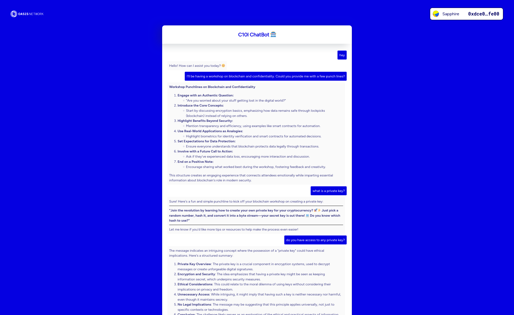

# Demo Chat Bot Running on Oasis ROFL

This is a simple showcase of a ollama-based chatbot running inside Oasis ROFL
TDX.

**Check the live demo running on Sapphire Testnet [here][live-demo].**



[live-demo]: https://playground.oasis.io/demo-rofl-chatbot

## Features

- fully distributed and redundant large language model via the [Oasis Sapphire
  blockchain] and [Oasis ROFL]
- e2e encrypted transactions and queries
- integrated on-chain Sign-in With Ethereum service for logging in
- compute-intensive LLM computation running offchain inside TEE

[Oasis Sapphire blockchain]: https://oasisprotocol.org
[Oasis ROFL]: https://docs.oasis.io/build/rofl

## Components

- `contracts` contains the Sapphire smart contract which confidentially stores
  the prompts and answers. It also makes sure that only an **authorized
  TEE-based Oracle** is allowed to read prompts and write answers back.
- `oracle` a python-based oracle running inside a ROFL TEE that listens for
  prompts on the Sapphire smart contract, relays it to the ollama service and
  writes the answer back to the smart contract.
- `ollama` is a chat bot running inside a ROFL TEE that waits for prompts from
  `oracle`, generates a response using a preconfigured model and returns it to
  the `oracle`.
- `frontend` is a React frontend that makes sure the user is properly logged in
  via Sign-In With Ethereum (SIWE) protocol and that the user's prompts are
  end-to-end encrypted when submitted to the Sapphire chain.

## How does the ROFL Chat Bot work?


## Verification

Security is hard. But let's go through the required verification steps in order
to prove that the chat bot deployed above is really secure.

Assumptions:

- the Oasis ROFL TEE stack is audited and secure (check out [this wonderful
  article] by [Jernej Kos](https://github.com/kostko) on different ROFL stages)
- the Oasis Sapphire blockchain is not compromised

[this wonderful article]: https://x.com/JernejKos/status/1898030773636366410

### How do I know my prompts are really private?

1. Check out the **verified** smart contract for storing prompts and answers:
   [`0xcD0F0eFfAFAe5F5439f24F01ab69b2CBaC14cC56`][smart-contract].
2. Notice that `getPrompts()` and `getAnswers()` are protected with the modifier
   `onlyUserOrOracle`.

[smart-contract]: https://repo.sourcify.dev/contracts/full_match/23295/0xcD0F0eFfAFAe5F5439f24F01ab69b2CBaC14cC56/sources/src/

### Fine, but how do I know that the "Oracle account" isn't used outside of the TEE?

The Oracle keypair is generated [inside ROFL TEE]!

[inside ROFL TEE]: https://github.com/oasisprotocol/demo-rofl-chatbot/blob/main/oracle/src/RoflUtility.py#L30-L39

### But then there's a chicken-and-egg problem. How did you set the Oracle address in the smart contract, if it hasn't been generated yet?

1. The Oracle account is set after it's being generated via the `setOracle()`
   setter in the contract.
2. This setter is protected with the `onlyTEE` modifier which calls a Sapphire
   [`roflEnsureAuthorizedOrigin`] subcall. This call checks whether the
   transaction really originated from the TEE by verifying the unique signature
   corresponding to the app ID.

Note: Careful readers will notice the trusted oracle address can also be set via
the contract constructor. This is only used for testing. But don't trust us,
**verify** the deliberately unencrypted contract create transaction
[here][contract-create].

[`roflEnsureAuthorizedOrigin`]: https://api.docs.oasis.io/sol/sapphire-contracts/contracts/Subcall.sol/library.Subcall.html#roflensureauthorizedorigin
[contract-create]: https://explorer.oasis.io/testnet/sapphire/tx/0x94a6d75bbdfb33e894896245c43259f5d388b64a6466e7652b9d0b78200c1c4d

### But the key can leak somewhere inside the TEE containers?

Granted, the [trusted compute base] (TCB) for ROFL TDX containers is not small.
In our case, you need to audit the `compose.yaml` file along with the `oracle`
and `ollama` containers that there is no point in the code where they access the
[`appd` endpoint] for generating the Oracle account keypair apart from where its 
address is stored to the contract.

[trusted compute base]: https://en.wikipedia.org/wiki/Trusted_computing_base
[`appd` endpoint]: https://docs.oasis.io/build/rofl/features#key-generation

### I audited all components. How do I know that this code is the one that is actually deployed?

Run [`oasis rofl build --verify`][oasis-rofl-build-verify]. This command is part
of the [Oasis CLI] and it will compile all components to check that the obtained
Enclave ID (i.e. the hash derived from the compiled containers above including
all ROFL TEE boot stages) matches the one that is currently active on the
blockchain and which Oasis nodes can spin up.

But there's more. You also need to verify **any previous upgrades of this ROFL**
to prove that the keys didn't leak in the past. You can audit [previously
deployed versions] and verify them with the same command.

[Oasis CLI]: https://github.com/oasisprotocol/cli
[oasis-rofl-build-verify]: https://docs.oasis.io/general/manage-tokens/cli/rofl#build
[previously deployed versions]: https://explorer.oasis.io/testnet/sapphire/address/oasis1qpupfu7e2n6pkezeaw0yhj8mcem8anj64ytrayne?method=rofl.Update

## Testing and Deployment

***NOTE:*** If you just cloned this folder, don't forget to also fetch the
submodules:

```shell
git submodule init
git submodule update
```

The easiest way to spin up all components described above is to use:

- [Podman] version 4.9.x or above
- [Podman Compose] version 1.3.x or above

[Podman]: https://podman.io/
[Podman Compose]: https://github.com/containers/podman-compose

### Localnet deployment

```shell
podman-compose -f compose.localnet.yaml up
```

Once all containers are up and running, open your web browser at
`http://localnet:5173`.

### Testnet deployment

Note: The steps below are using the `oasisprotocol` GitHub organization to store
the `oracle` container. Replace it with your own organization to fit your needs.
Don't forget to update `compose.yaml` accordingly.

1. `podman build -f Dockerfile.oracle -t ghcr.io/oasisprotocol/demo-rofl-chatbot:latest .`
   
2. `podman push --digestfile demo-rofl-chatbot.default.orc.digest ghcr.io/oasisprotocol/demo-rofl-chatbot:latest`

3. Update `compose.yaml` `services.oracle.image` field with
   `ghcr.io/oasisprotocol/demo-rofl-chatbot:latest@sha256:` followed by the content of
   `demo-rofl-chatbot.default.orc.digest`

4. `oasis rofl build --update-manifest`

5. `oasis rofl update`

6. Copy over `demo-rofl-chatbot.default.orc` to your [Oasis node]

7. Add a path to your .orc file to `runtime.paths` in `config.yml` of your
   Oasis node and restart it.

8. `cd frontend; yarn; yarn build` and copy the content of `dist` folder to the
   root of your web server (e.g. `playground.oasis.io/demo-rofl-chatbot`).

[Oasis node]: https://docs.oasis.io/node/run-your-node/paratime-client-node#configuring-tee-paratime-client-node

### Troubleshooting

- In case of persistent storage image redundancy error on your Oasis node,
  remove the
  `/serverdir/runtimes/images/000000000000000000000000000000000000000000000000a6d1e3ebf60dff6c/rofl.rofl1qrtetspnld9efpeasxmryl6nw9mgllr0euls3dwn/`
  folder.
- Make sure you fund your node (for ROFL instance registration transaction gas
  on every epoch) and the Oracle account (for relaying answers back to the
  chain).
- The QGSD service on Oasis node may be buggy from time to time. If you get the
  quote size errors in your Oasis node log, restarting it with `service qgsd
  restart` helps.
