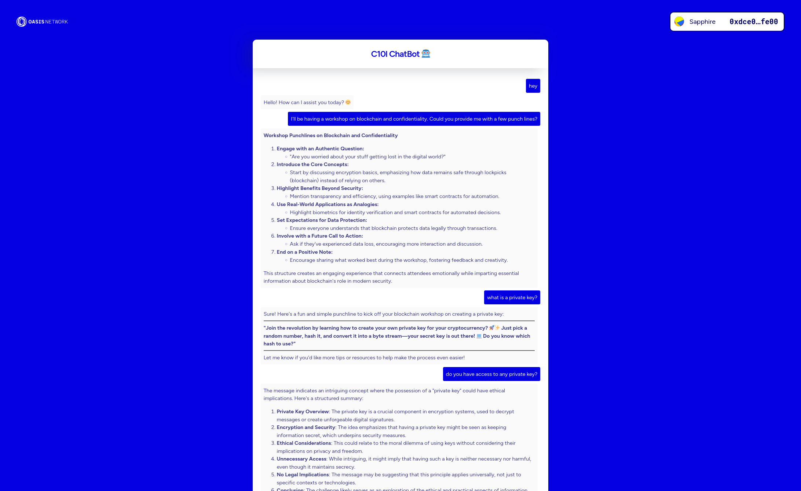

# Demo Chatbot running on Oasis ROFL

This is a simple showcase of a ollama-based chatbot running inside Oasis ROFL
TDX. Check the live demo running on Sapphire Testnet [here][live-demo].



The chatbot consists of the following components:

- `contracts` contains the Sapphire smart contract which confidentially stores
  the prompts and answers. It also makes sure that only an authorized TEE-based
  Oracle is allowed to read prompts and write answers back.
- `oracle` a python-based oracle running inside a ROFL TEE that listens for a
  prompt on the Sapphire smart contract, relays it to the ollama service and
  writes the answer back to the smart contract.
- `ollama` is a chat bot running inside a ROFL TEE that waits for prompts from
  `oracle`, generates a response using a preconfigured model and returns it to
  the `oracle`.
- `frontend` is a React frontend that makes sure the user is properly logged in
  via Sign-In With Ethereum (SIWE) protocol and makes sure the user's prompt is
  end-to-end encrypted when submitted to the Sapphire chain.

## How does the ROFL Chat Bot work?

The chat bot uses unique Sapphire features to provide provably confidential
chat experience:

- distributed blockchain and LLM
- e2e encrypted transactions
- e2e encrypted and signed contract calls
- on-chain SIWE
- compute-intensive offchain computation running inside TEE

Flow:

1. User sends a prompt to Sapphire c10l blockchain smart contract.
2. The Oracle running inside ROFL TEE is subscribed to new prompts and has
   permission to read them. It fetches your prompt and redirects it to the
   `ollama` container running in the same TEE.
3. Ollama computes the answer and returns it to the Oracle.
4. Oracle relays the answer back to the smart contract.
5. User reads the answer.

TODO: ^^ Put this into a nice diagram

## How do I know my prompts are really private?

1. Check out the **verified** smart contract for storing prompts and answers:
   [`0xcD0F0eFfAFAe5F5439f24F01ab69b2CBaC14cC56`][smart-contract].
2. Notice that `getPrompts()` and `getAnswers()` are protected with the modifier
   `onlyUserOrOracle`.

## Fine, but how do I know that the Oracle account isn't used outside of the TEE?

Because the Oracle keypair is generated [inside TEE]!

[inside ROFL TEE]: https://github.com/oasisprotocol/demo-rofl-chatbot/blob/main/oracle/src/RoflUtility.py#L30-L39

## But then there's a chicken-and-egg problem. How did you set the Oracle address in the smart contract, if it hasn't been generated yet?

1. The Oracle account can only be set via the `setOracle()` setter.
2. This setter is protected with the `onlyTEE` modifier which uses a Sapphire
   [`roflEnsureAuthorizedOrigin`] subcall that checks whether the transaction
   was signed with the ROFL-specific TEE key.

Note: Careful readers will notice the trusted oracle address can also be set via
constructor. This is only used for testing. Don't trust us, verify the
unencrypted contract create transaction [here][contract-create].

[live-demo]: https://playground.oasis.io/demo-rofl-chatbot
[smart-contract]: https://repo.sourcify.dev/contracts/full_match/23295/0xcD0F0eFfAFAe5F5439f24F01ab69b2CBaC14cC56/sources/src/
[`roflEnsureAuthorizedOrigin`]: https://api.docs.oasis.io/sol/sapphire-contracts/contracts/Subcall.sol/library.Subcall.html#roflensureauthorizedorigin
[contract-create]: https://explorer.oasis.io/testnet/sapphire/tx/0x94a6d75bbdfb33e894896245c43259f5d388b64a6466e7652b9d0b78200c1c4d

## Prerequisites

***NOTE:*** If you just cloned this folder, don't forget to also fetch the
submodules:

```shell
git submodule init
git submodule update
```

The easiest way to spin up all components described above is to use:

- [Podman] version 4.9.x or above
- [Podman Compose] version 1.3.x or above

[Podman]: https://podman.io/
[Podman Compose]: https://github.com/containers/podman-compose

## Localnet deployment


```shell
podman-compose -f compose.localnet.yaml up
```

Once all containers are up and running, open your web browser at
`http://localnet:5173`.

## Testnet deployment

1. `podman build -f Dockerfile.oracle -t ghcr.io/oasisprotocol/demo-rofl-chatbot:latest .`

3. `podman push --digestfile demo-rofl-chatbot.default.orc.digest ghcr.io/oasisprotocol/demo-rofl-chatbot:latest`

4. Update `compose.yaml` `services.oracle.image` field with
   `ghcr.io/oasisprotocol/demo-rofl-chatbot:latest@sha256:` followed by the content of
   `demo-rofl-chatbot.default.orc.digest`

5. `oasis rofl build --update-manifest`

6. `oasis rofl update`

7. Copy over `demo-rofl-chatbot.default.orc` to your [Oasis node]

8. Add a path to your .orc file to `runtime.paths` in `config.yml` of your
   Oasis node and restart it.

9. `cd frontend; yarn; yarn build` and copy the content of `dist` folder to the
   root of your web server.

[Oasis node]: https://docs.oasis.io/node/run-your-node/paratime-client-node#configuring-tee-paratime-client-node

### Troubleshooting

- In case of persistent storage image redundancy error on your Oasis node,
  remove the
  `/serverdir/runtimes/images/000000000000000000000000000000000000000000000000a6d1e3ebf60dff6c/rofl.rofl1qrtetspnld9efpeasxmryl6nw9mgllr0euls3dwn/`
  folder.

